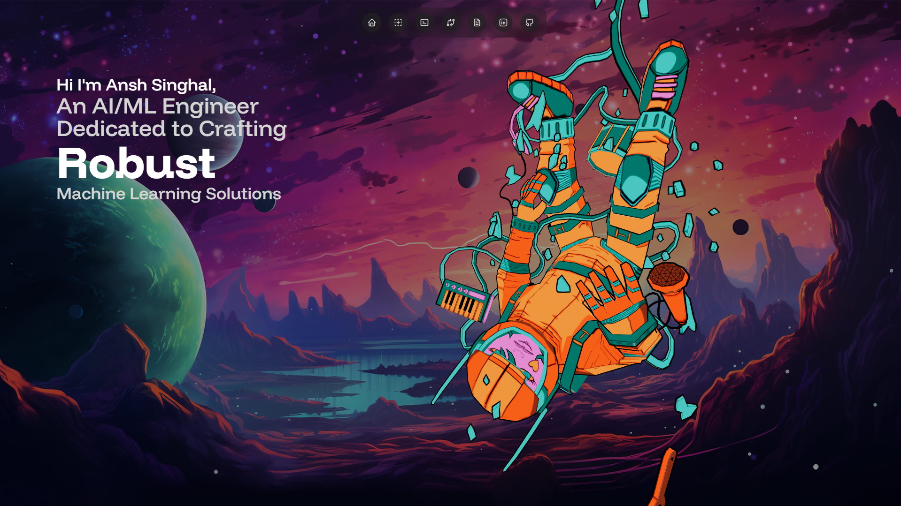

# Ansh Singhal's Portfolio Website

A modern, responsive portfolio website showcasing my work as an AI/ML Engineer and Open Source Contributor. Built with React, Three.js, and Vite, featuring a sleek design and interactive 3D elements.




## 🌟 Features

- **Interactive 3D Elements**: Engaging 3D animations and visualizations using Three.js
- **Responsive Design**: Fully responsive layout that works on all devices
- **Modern UI/UX**: Clean and intuitive user interface with smooth animations
- **Performance Optimized**: Built with Vite for fast loading and optimal performance
- **SEO Friendly**: Comprehensive meta tags and structured data for better search engine visibility
- **Dark Mode**: Elegant dark theme with customizable color schemes
- **Contact Form**: Integrated contact form with EmailJS for easy communication
- **Social Integration**: Direct links to professional profiles (GitHub, LinkedIn, Kaggle)

## 🛠️ Technologies Used

- **Frontend Framework**: React.js
- **Build Tool**: Vite
- **3D Graphics**: Three.js
- **Styling**: Tailwind CSS
- **Animations**: Framer Motion
- **Email Service**: EmailJS
- **Analytics**: Google Analytics
- **Version Control**: Git

## 🚀 Getting Started

### Prerequisites

- Node.js (v14.0.0 or higher)
- npm or yarn

### Installation

1. Clone the repository:
   ```bash
   git clone https://github.com/AnshSinghal/portfolio.git
   ```

2. Navigate to the project directory:
   ```bash
   cd portfolio
   ```

3. Install dependencies:
   ```bash
   npm install
   # or
   yarn install
   ```

4. Start the development server:
   ```bash
   npm run dev
   # or
   yarn dev
   ```

5. Open [http://localhost:5173](http://localhost:5173) in your browser.

### Building for Production

```bash
npm run build
# or
yarn build
```

## 📁 Project Structure

```
portfolio/
├── public/
│   ├── assets/
│   │   ├── logos/
│   │   ├── projects/
│   │   └── socials/
│   ├── robots.txt
│   └── sitemap.xml
├── src/
│   ├── components/
│   ├── sections/
│   ├── constants/
│   ├── App.jsx
│   └── main.jsx
├── index.html
└── package.json
```

## 🔧 Configuration

### Environment Variables

Create a `.env` file in the root directory:

```env
VITE_EMAILJS_SERVICE_ID=your_service_id
VITE_EMAILJS_TEMPLATE_ID=your_template_id
VITE_EMAILJS_PUBLIC_KEY=your_public_key
VITE_GA_TRACKING_ID=your_ga_tracking_id
```

### Customization

- Update personal information in `src/constants/index.js`
- Modify meta tags in `index.html`
- Customize colors in `tailwind.config.js`

## 📱 Responsive Design

The portfolio is fully responsive and optimized for:
- Desktop (1920px and below)
- Tablet (1024px and below)
- Mobile (768px and below)

## 🔍 SEO Features

- Meta tags optimization
- Structured data (JSON-LD)
- Sitemap generation
- Robots.txt configuration
- Open Graph and Twitter Card support

## 📊 Analytics

Google Analytics integration for tracking:
- Page views
- User behavior
- Traffic sources
- Custom events

## 🤝 Contributing

Contributions are welcome! Please feel free to submit a Pull Request.

## 📄 License

This project is licensed under the MIT License - see the [LICENSE](LICENSE) file for details.

## 👤 Contact

- **Email**: anshsinghal3107@gmail.com
- **LinkedIn**: [Ansh Singhal](https://www.linkedin.com/in/anshhh-singhal/)
- **GitHub**: [@AnshSinghal](https://github.com/AnshSinghal)
- **Kaggle**: [@anshsinghal3107](https://www.kaggle.com/anshsinghal3107)

---

Made with ❤️ by Ansh Singhal
